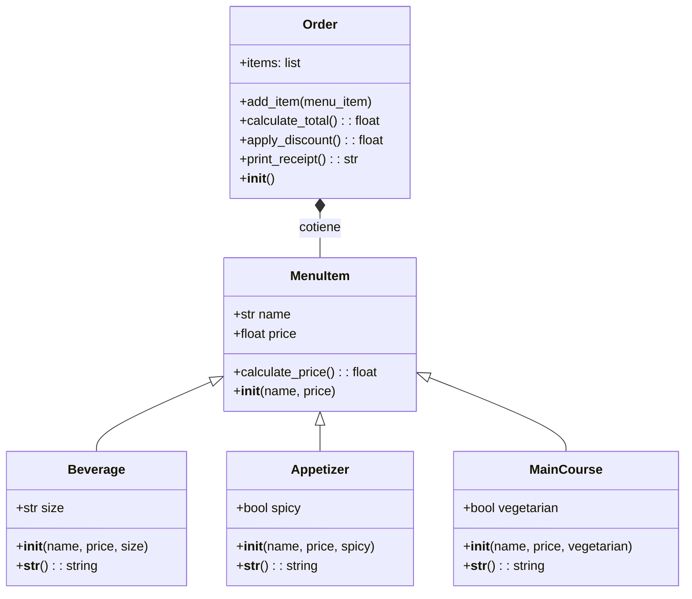

# reto_3
1. Restaurant scenario: You want to design a program to calculate the bill for a customer's order in a restaurant.
+ Define a base class MenuItem: This class should have attributes like name, price, and a method to calculate the total price.
+ Create subclasses for different types of menu items: Inherit from MenuItem and define properties specific to each type (e.g., Beverage, Appetizer, MainCourse).
+ Define an Order class: This class should have a list of MenuItem objects and methods to add items, calculate the total bill amount, and potentially apply specific discounts based on the order composition.

Create a class diagram with all classes and their relationships. The menu should have at least 10 items. The code should follow PEP8 rules.

## Class Diagram
La clase base o padre es Order, ya que esta compuesta por "objetos" de la clase MenuItem, a su vez MenuItem hereda los atributos de **name** y **price** a las subclases: Beverage, Appetizer y MainCourse 

## Pyhton Code

```python
class MenuItem:
    def __init__(self, name, price):
        self.name = name
        self.price = price

    def calculate_price(self):
        return self.price

    def __str__(self):
        return f"{self.name}: ${self.price:.2f}"


class Beverage(MenuItem):
    def __init__(self, name, price, size):
        super().__init__(name, price)
        self.size = size

    def __str__(self):
        return f"{self.name} ({self.size}): ${self.price:.2f}"


class Appetizer(MenuItem):
    def __init__(self, name, price, spicy=False):
        super().__init__(name, price)
        self.spicy = spicy

    def __str__(self):
        spice = "Spicy" if self.spicy else "Non-Spicy"
        return f"{self.name} ({spice}): ${self.price:.2f}"


class MainCourse(MenuItem):
    def __init__(self, name, price, vegetarian=False):
        super().__init__(name, price)
        self.vegetarian = vegetarian

    def __str__(self):
        type_of_dish = "Vegetarian" if self.vegetarian else "Non-Vegetarian"
        return f"{self.name} ({type_of_dish}): ${self.price:.2f}"


class Order:
    def __init__(self):
        self.items = []

    def add_item(self, menu_item):
        self.items.append(menu_item)

    def calculate_total(self):
        return sum(item.calculate_price() for item in self.items)

    # If there's more than 5 items on the order, it will apply a 10% discount
    def apply_discount(self):
        total = self.calculate_total()
        if len(self.items) > 5:
            total *= 0.10
        return total

    def print_receipt(self):
        print("Order Receipt:")
        for item in self.items:
            print(f"- {item}")
        print(f"\nSubtotal: ${self.calculate_total():.2f}")
        Subtotal = self.calculate_total()
        discounted_total = self.apply_discount()
        if discounted_total != Subtotal:
            print(f"Discounted Total: ${discounted_total:.2f}")
            Total = self.calculate_total() - discounted_total
            print(f"Total: $ {Total:.2f}")
        else:
            print(f"Total: $ {Subtotal:.2f}")


# It creates the order with all the food, and then prints the receipt
if __name__ == "__main__":
    order = Order()
    order.add_item(Beverage("Coke", 2.0, "small"))
    order.add_item(Beverage("Tamarindo", 3.0, "medium"))
    order.add_item(Appetizer("Tacos de al pastor", 3.0, True))
    order.add_item(Appetizer("Flauta", 6.5, False))
    order.add_item(MainCourse("Veggie Burrito", 8.0, True))
    order.add_item(MainCourse("enchilada", 12.0, True))

    order.print_receipt()
```
## Output (with discount)
Al tener mas de 5 productos, se aplica un descuento del 10%
```bash
Order Receipt:
- Coke (small): $2.00
- Tamarindo (medium): $3.00
- Tacos de al pastor (Spicy): $3.00
- Flauta (Non-Spicy): $6.50
- Veggie Burrito (Vegetarian): $8.00
- enchilada (Vegetarian): $12.00

Subtotal: $34.50
Discounted Total: $3.45
Total: $ 31.05
```
## Output (without discount)
Al no tener mas de 5 productos el descuento no se aplica
```bash
Order Receipt:
- Coke (small): $2.00
- Tacos de al pastor (Spicy): $3.00
- Burrito (Non-Vegetarian): $8.00
- Ceviche (Non-Vegetarian): $12.00

Subtotal: $25.00
Total: $ 25.00
```
